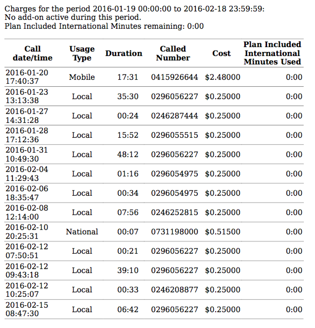

# Clean logs of mobile data

This was a freelance project all the way from Australia where I had to clean a large messy file of data and put it into very neat CSV files.

Each line of this messy file was different, so I had to detect which structure of messy data it was with Regular Expressions.

The task was: 

> I have converted over 1000 pages of phone records (PDF tables) into text files. I want the data in these text files to be saved to a CSV / google sheet. The data will be filtered by column and row.  Specifically I want to extract Call date/time, Duration, is the "event" an SMS, Called number, Reference to phone record. Sample inputs (text files) and expected output (google sheet with three tabs) is here: Screen shots of phone records will be provided so you can see what the records looked like in pdf.

My response:

> As always very happy with Mark's work - he's responsive, enthusiastic and most importantly gets the job done. A pleasure to work with.

| File | Purpose |
| ------ | ------ |
| mobile.py | Decipher messy code with regular expressions to turn it into neat CSV files so my Australian client can use Pandas for data analysis |



# Code Snippet

```python

#note
#
#TWO TYPES OF ROWS
#
#1) data = ['Data', '0.02MB', '0.02MB', '$0.00000', '$0.00000', '$0.00000']
#
#
#2) calls =  ['Mobile', 'Call', '09:46', '0418695084', '0.00MB', '$9.35000', '$0.00000', '$0.00000']
#
#//ANCHOR: REGEX ROWS
data_regex_row = '(%s)%s(%s)%s(%s)%s(%s)%s(%s)%s(%s)' % (series_of_words_regex , space_new_regex , disk_space_regex , space_new_regex , disk_space_regex , space_new_regex , currency_regex , space_new_regex , currency_regex , space_new_regex , currency_regex)
calls_mobile_regex_row = '(%s)%s(%s)%s(%s)%s(%s)%s(%s)%s(%s)%s(%s)' % (series_of_words_regex , space_new_regex, duration_regex , space_new_regex , phone_number_regex , space_new_regex , disk_space_regex , space_new_regex , currency_regex , space_new_regex , currency_regex , space_new_regex , currency_regex)
sms_national_regex_row = '(%s)%s(%s)%s(%s)%s(%s)%s(%s)%s(%s)%s(%s)' % (series_of_words_regex , space_new_regex, integer_regex , space_new_regex , phone_number_regex , space_new_regex , disk_space_regex , space_new_regex , currency_regex , space_new_regex , currency_regex , space_new_regex , currency_regex)
calls_phone_regex_row = '(%s)%s(%s)%s(%s)%s(%s)%s(%s)' % (series_of_words_regex , space_new_regex, duration_regex , space_new_regex , phone_number_regex , space_new_regex , currency_regex , space_new_regex , duration_regex)
```